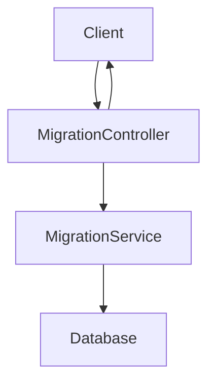

# Overview

The web package in Pgr services refers to the package structure and models used to define and manage various service-related entities. This document provides an in-depth understanding of the web package, its models, and controllers.

# Models

The package <SwmToken path="municipal-services/pgr-services/src/main/java/org/egov/pgr/web/models/pgrV1/ServiceDef.java" pos="1:2:12" line-data="package org.egov.pgr.web.models.pgrV1;">`org.egov.pgr.web.models.pgrV1`</SwmToken> contains models such as <SwmToken path="municipal-services/pgr-services/src/main/java/org/egov/pgr/web/models/pgrV1/ServiceDef.java" pos="19:26:26" line-data=" *  This will be the MDMS data.  Defines the structure of a service provided by the administration. This is based on Open311 standard, but extends it in follwoing important ways -  1. metadata is changed from boolean to strign and represents a valid swgger 2.0 definition url of the metadata definition. If this is null then it is assumed taht service does not have any metadata, else the metadata is defined in the OpenAPI definition. This allows for a well structured powerful metadata definition.  2. Due to this ServiceRequest object has been enhanced to include metadata values (aka attribute value in Open311) as an JSON object. ">`service`</SwmToken>, <SwmToken path="municipal-services/pgr-services/src/main/java/org/egov/pgr/web/models/pgrV1/ServiceDef.java" pos="28:4:4" line-data="public class ServiceDef   {">`ServiceDef`</SwmToken>, <SwmToken path="municipal-services/pgr-services/src/main/java/org/egov/pgr/web/controllers/MigrationController.java" pos="29:16:16" line-data="    public ResponseEntity&lt;Map&gt; requestsCreatePost(@Valid @RequestBody ServiceResponse request) throws IOException {">`ServiceResponse`</SwmToken>, and others. These models represent different aspects of the services provided by the administration. They include annotations for JSON serialization and validation, ensuring that the data conforms to the expected structure and constraints.

<SwmSnippet path="/municipal-services/pgr-services/src/main/java/org/egov/pgr/web/models/pgrV1/ServiceDef.java" line="1">

---

The <SwmToken path="municipal-services/pgr-services/src/main/java/org/egov/pgr/web/models/pgrV1/ServiceDef.java" pos="28:4:4" line-data="public class ServiceDef   {">`ServiceDef`</SwmToken> model defines the structure of a service provided by the administration, extending the <SwmToken path="municipal-services/pgr-services/src/main/java/org/egov/pgr/web/models/pgrV1/ServiceDef.java" pos="19:45:45" line-data=" *  This will be the MDMS data.  Defines the structure of a service provided by the administration. This is based on Open311 standard, but extends it in follwoing important ways -  1. metadata is changed from boolean to strign and represents a valid swgger 2.0 definition url of the metadata definition. If this is null then it is assumed taht service does not have any metadata, else the metadata is defined in the OpenAPI definition. This allows for a well structured powerful metadata definition.  2. Due to this ServiceRequest object has been enhanced to include metadata values (aka attribute value in Open311) as an JSON object. ">`Open311`</SwmToken> standard to include metadata definitions and enhanced service request objects.

```java
package org.egov.pgr.web.models.pgrV1;

import com.fasterxml.jackson.annotation.JsonCreator;
import com.fasterxml.jackson.annotation.JsonInclude;
import com.fasterxml.jackson.annotation.JsonProperty;
import com.fasterxml.jackson.annotation.JsonValue;
import lombok.AllArgsConstructor;
import lombok.Builder;
import lombok.NoArgsConstructor;
import org.springframework.validation.annotation.Validated;
```

---

</SwmSnippet>

# Controllers

The <SwmToken path="municipal-services/pgr-services/src/main/java/org/egov/pgr/web/models/pgrV1/ServiceDef.java" pos="1:8:8" line-data="package org.egov.pgr.web.models.pgrV1;">`web`</SwmToken> package includes controllers like `RequestsApiController`, which handle incoming HTTP requests related to service management and processing.

# Migration APIs

The `/migration/_transform` endpoint is defined in the <SwmToken path="municipal-services/pgr-services/src/main/java/org/egov/pgr/web/controllers/MigrationController.java" pos="21:4:4" line-data="public class MigrationController {">`MigrationController`</SwmToken> class. It handles POST requests to transform and migrate service data. The endpoint accepts a <SwmToken path="municipal-services/pgr-services/src/main/java/org/egov/pgr/web/controllers/MigrationController.java" pos="29:16:16" line-data="    public ResponseEntity&lt;Map&gt; requestsCreatePost(@Valid @RequestBody ServiceResponse request) throws IOException {">`ServiceResponse`</SwmToken> object in the request body, processes it using the <SwmToken path="municipal-services/pgr-services/src/main/java/org/egov/pgr/web/controllers/MigrationController.java" pos="31:13:13" line-data="        Map&lt;String, Object&gt; response = migrationService.migrate(request);">`migrationService`</SwmToken>, and returns a response with the transformed data.

<SwmSnippet path="/municipal-services/pgr-services/src/main/java/org/egov/pgr/web/controllers/MigrationController.java" line="28">

---

The <SwmToken path="municipal-services/pgr-services/src/main/java/org/egov/pgr/web/controllers/MigrationController.java" pos="21:4:4" line-data="public class MigrationController {">`MigrationController`</SwmToken> class handles the `/migration/_transform` endpoint, which processes and migrates service data using the <SwmToken path="municipal-services/pgr-services/src/main/java/org/egov/pgr/web/controllers/MigrationController.java" pos="31:13:13" line-data="        Map&lt;String, Object&gt; response = migrationService.migrate(request);">`migrationService`</SwmToken>.

```java
    @RequestMapping(value="/_transform", method = RequestMethod.POST)
    public ResponseEntity<Map> requestsCreatePost(@Valid @RequestBody ServiceResponse request) throws IOException {

        Map<String, Object> response = migrationService.migrate(request);

        return new ResponseEntity<>(response, HttpStatus.OK);

    }
```

---

</SwmSnippet>

&nbsp;

*This is an auto-generated document by Swimm AI 🌊 and has not yet been verified by a human*

<SwmMeta version="3.0.0" repo-id="Z2l0aHViJTNBJTNBRElHSVQtT1NTJTNBJTNBU3dpbW0tRGVtbw==" repo-name="DIGIT-OSS" doc-type="overview"><sup>Powered by [Swimm](/)</sup></SwmMeta>
