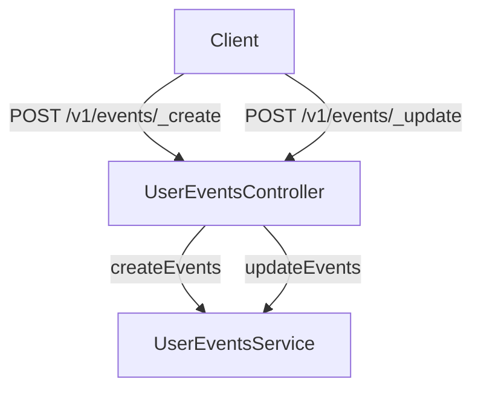

# Overview

The Egov user event service is designed to manage all events generated for users within the system. These events can originate from various applications such as PT, PGR, and TL, or be created by employees addressing citizens. This service provides APIs to create, update, and search for user events, ensuring that all notifications relevant to the user are efficiently handled. User events can be created either through API calls or by pushing records to the Kafka Queue, making the system flexible and scalable.

# Service Dependencies

The Egov user event service depends on other services like `egov-mdms-service` and `egov-localization` to function correctly.

# API Details

The service provides several APIs such as `/_create` to create events, <SwmToken path="municipal-services/egov-user-event/src/main/java/org/egov/userevent/web/controller/UserEventsController.java" pos="91:5:6" line-data="	@PostMapping(&quot;/_update&quot;)">`/_update`</SwmToken> to update events, <SwmToken path="municipal-services/egov-user-event/src/main/java/org/egov/userevent/web/controller/UserEventsController.java" pos="105:5:6" line-data="	@PostMapping(&quot;/_search&quot;)">`/_search`</SwmToken> to search events, `/notification/_count` to fetch notification counts, and <SwmToken path="municipal-services/egov-user-event/src/main/java/org/egov/userevent/web/controller/UserEventsController.java" pos="138:5:8" line-data="	@PostMapping(&quot;/lat/_update&quot;)">`/lat/_update`</SwmToken> to update the last-login-time of the user.

# Main Functions

There are several main functions in this service. Some of them are create, update, and search. We will dive a little into each of these functions.

## Create

The <SwmToken path="municipal-services/egov-user-event/src/main/java/org/egov/userevent/web/controller/UserEventsController.java" pos="71:7:7" line-data="	 * Endpoint to create events in the system.">`create`</SwmToken> function allows the creation of new user events in the system. This can be done either through an API call or by pushing records to the Kafka Queue.

## Update

The <SwmToken path="municipal-services/egov-user-event/src/main/java/org/egov/userevent/web/controller/UserEventsController.java" pos="93:6:6" line-data="	private ResponseEntity&lt;?&gt; update(@RequestBody @Valid EventRequest request) {">`update`</SwmToken> function enables the modification of existing user events. This ensures that any changes or updates to the events are reflected in the system.

## Search

The <SwmToken path="municipal-services/egov-user-event/src/main/java/org/egov/userevent/web/controller/UserEventsController.java" pos="99:7:7" line-data="	 * Endpoint to search events in the system.">`search`</SwmToken> function allows users to retrieve events based on specific criteria. This is useful for finding relevant events and notifications.

# User Event Endpoints

The following are the main endpoints for managing user events.

## /v1/events/\_create

The `/v1/events/_create` endpoint is used to create new events in the system. It accepts a POST request with an <SwmToken path="municipal-services/egov-user-event/src/main/java/org/egov/userevent/web/controller/UserEventsController.java" pos="93:14:14" line-data="	private ResponseEntity&lt;?&gt; update(@RequestBody @Valid EventRequest request) {">`EventRequest`</SwmToken> payload and returns a <SwmToken path="municipal-services/egov-user-event/src/main/java/org/egov/userevent/web/controller/UserEventsController.java" pos="93:3:3" line-data="	private ResponseEntity&lt;?&gt; update(@RequestBody @Valid EventRequest request) {">`ResponseEntity`</SwmToken> containing an <SwmToken path="municipal-services/egov-user-event/src/main/java/org/egov/userevent/web/controller/UserEventsController.java" pos="94:1:1" line-data="		EventResponse response = service.updateEvents(request);">`EventResponse`</SwmToken>.

## /v1/events/\_update

The `/v1/events/_update` endpoint is used to update existing events in the system. It accepts a POST request with an <SwmToken path="municipal-services/egov-user-event/src/main/java/org/egov/userevent/web/controller/UserEventsController.java" pos="93:14:14" line-data="	private ResponseEntity&lt;?&gt; update(@RequestBody @Valid EventRequest request) {">`EventRequest`</SwmToken> payload and returns a <SwmToken path="municipal-services/egov-user-event/src/main/java/org/egov/userevent/web/controller/UserEventsController.java" pos="93:3:3" line-data="	private ResponseEntity&lt;?&gt; update(@RequestBody @Valid EventRequest request) {">`ResponseEntity`</SwmToken> containing an <SwmToken path="municipal-services/egov-user-event/src/main/java/org/egov/userevent/web/controller/UserEventsController.java" pos="94:1:1" line-data="		EventResponse response = service.updateEvents(request);">`EventResponse`</SwmToken>.

<SwmSnippet path="/municipal-services/egov-user-event/src/main/java/org/egov/userevent/web/controller/UserEventsController.java" line="91">

---

The <SwmToken path="municipal-services/egov-user-event/src/main/java/org/egov/userevent/web/controller/UserEventsController.java" pos="93:6:6" line-data="	private ResponseEntity&lt;?&gt; update(@RequestBody @Valid EventRequest request) {">`update`</SwmToken> method in <SwmToken path="municipal-services/egov-user-event/src/main/java/org/egov/userevent/web/controller/UserEventsController.java" pos="64:4:4" line-data="public class UserEventsController {">`UserEventsController`</SwmToken> handles the updating of existing events. It processes the <SwmToken path="municipal-services/egov-user-event/src/main/java/org/egov/userevent/web/controller/UserEventsController.java" pos="93:14:14" line-data="	private ResponseEntity&lt;?&gt; update(@RequestBody @Valid EventRequest request) {">`EventRequest`</SwmToken> and returns an <SwmToken path="municipal-services/egov-user-event/src/main/java/org/egov/userevent/web/controller/UserEventsController.java" pos="94:1:1" line-data="		EventResponse response = service.updateEvents(request);">`EventResponse`</SwmToken>.

```java
	@PostMapping("/_update")
	@ResponseBody
	private ResponseEntity<?> update(@RequestBody @Valid EventRequest request) {
		EventResponse response = service.updateEvents(request);
		return new ResponseEntity<>(response, HttpStatus.OK);
	}
```

---

</SwmSnippet>

&nbsp;

*This is an auto-generated document by Swimm AI 🌊 and has not yet been verified by a human*

<SwmMeta version="3.0.0" repo-id="Z2l0aHViJTNBJTNBRElHSVQtT1NTJTNBJTNBU3dpbW0tRGVtbw==" repo-name="DIGIT-OSS" doc-type="overview"><sup>Powered by [Swimm](/)</sup></SwmMeta>
