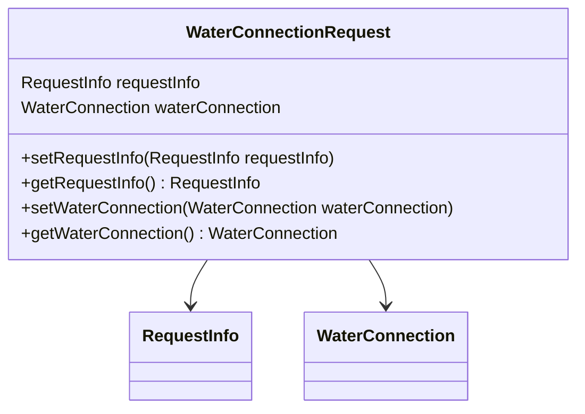

# Overview

The `WaterConnectionRequest` class is used to handle requests related to water connections. It encapsulates the request information and water connection details, ensuring proper encapsulation and validation. This class plays a vital role in the workflow of water connection applications, including sending notifications and updating application states.

<SwmSnippet path="/municipal-services/ws-calculator/src/main/java/org/egov/wscalculation/web/models/WaterConnectionRequest.java" line="20">

---

# Water Connection Request Class

The `WaterConnectionRequest` class encapsulates the request information and water connection details. It provides methods to set and get these properties, ensuring proper encapsulation and validation.

```java
/**
 * Contract class to receive request. Array of Property items are used in case
 * of create . Where as single Property item is used for update
 */
@ApiModel(description = "Contract class to receive request. Array of Property items  are used in case of create . Where as single Property item is used for update")
@Validated
@javax.annotation.Generated(value = "io.swagger.codegen.v3.generators.java.SpringCodegen", date = "2019-10-24T10:29:25.253+05:30[Asia/Kolkata]")
@Getter
@NoArgsConstructor
@AllArgsConstructor
@Setter
@Builder
public class WaterConnectionRequest {
	@JsonProperty("RequestInfo")
	private RequestInfo requestInfo = null;

	@JsonProperty("WaterConnection")
	private WaterConnection waterConnection = null;

	public WaterConnectionRequest requestInfo(RequestInfo requestInfo) {
		this.requestInfo = requestInfo;
```

---

</SwmSnippet>

<SwmSnippet path="/municipal-services/ws-calculator/src/main/java/org/egov/wscalculation/service/DemandService.java" line="193">

---

# Creating a Water Connection Request

An example of creating a `WaterConnectionRequest` instance with `requestInfo` and `waterConnection` details.

```java
			}
			WaterConnectionRequest waterConnectionRequest = WaterConnectionRequest.builder().waterConnection(connection)
					.requestInfo(requestInfo).build();
```

---

</SwmSnippet>

<SwmSnippet path="/municipal-services/ws-calculator/src/main/java/org/egov/wscalculation/web/models/WaterConnectionRequest.java" line="77">

---

# Setting Water Connection

The `setWaterConnection` method is used to set the `WaterConnection` property in the `WaterConnectionRequest` class.

```java
	public void setWaterConnection(WaterConnection waterConnection) {
		this.waterConnection = waterConnection;
	}
```

---

</SwmSnippet>

<SwmSnippet path="/municipal-services/ws-calculator/src/main/java/org/egov/wscalculation/web/models/WaterConnectionRequest.java" line="70">

---

# Getting Water Connection

The `getWaterConnection` method is used to retrieve the `WaterConnection` property from the `WaterConnectionRequest` class.

```java
	@ApiModelProperty(value = "")

	@Valid
	public WaterConnection getWaterConnection() {
		return waterConnection;
	}
```

---

</SwmSnippet>

<SwmSnippet path="/municipal-services/ws-calculator/src/main/java/org/egov/wscalculation/service/EstimationService.java" line="199">

---

# Using Water Connection Request in Services

An example of using `WaterConnectionRequest` in the `EstimationService` to get property details.

```java
		Property property = wSCalculationUtil.getProperty(
				WaterConnectionRequest.builder().waterConnection(waterConnection).requestInfo(requestInfo).build());
```

---

</SwmSnippet>

# Main Functions

The main functions in the `WaterConnectionRequest` class include `requestInfo`, `getRequestInfo`, `setRequestInfo`, `waterConnection`, `getWaterConnection`, and `setWaterConnection`. Below are detailed explanations of these functions.

<SwmSnippet path="/municipal-services/ws-calculator/src/main/java/org/egov/wscalculation/web/models/WaterConnectionRequest.java" line="39">

---

## requestInfo

The `requestInfo` function sets the `RequestInfo` property of the `WaterConnectionRequest` object. This method allows chaining by returning the current instance of `WaterConnectionRequest`.

```java
	public WaterConnectionRequest requestInfo(RequestInfo requestInfo) {
		this.requestInfo = requestInfo;
		return this;
```

---

</SwmSnippet>

<SwmSnippet path="/municipal-services/ws-calculator/src/main/java/org/egov/wscalculation/web/models/WaterConnectionRequest.java" line="56">

---

## setRequestInfo

The `setRequestInfo` function sets the `RequestInfo` property of the `WaterConnectionRequest` object. This method is used to update the metadata about the request.

```java
	public void setRequestInfo(RequestInfo requestInfo) {
		this.requestInfo = requestInfo;
	}
```

---

</SwmSnippet>

<SwmSnippet path="/municipal-services/ws-calculator/src/main/java/org/egov/wscalculation/web/models/WaterConnectionRequest.java" line="70">

---

## getWaterConnection

The `getWaterConnection` function retrieves the `WaterConnection` property from the `WaterConnectionRequest` object. This method is used to access the details about the water connection.

```java
	@ApiModelProperty(value = "")

	@Valid
	public WaterConnection getWaterConnection() {
		return waterConnection;
	}
```

---

</SwmSnippet>

<SwmSnippet path="/municipal-services/ws-calculator/src/main/java/org/egov/wscalculation/web/models/WaterConnectionRequest.java" line="77">

---

## setWaterConnection

The `setWaterConnection` function sets the `WaterConnection` property of the `WaterConnectionRequest` object. This method is used to update the details about the water connection.

```java
	public void setWaterConnection(WaterConnection waterConnection) {
		this.waterConnection = waterConnection;
	}
```

---

</SwmSnippet>

&nbsp;

*This is an auto-generated document by Swimm AI 🌊 and has not yet been verified by a human*

<SwmMeta version="3.0.0" repo-id="Z2l0aHViJTNBJTNBRElHSVQtT1NTJTNBJTNBU3dpbW0tRGVtbw==" repo-name="DIGIT-OSS" doc-type="overview"><sup>Powered by [Swimm](https://app.swimm.io/)</sup></SwmMeta>
