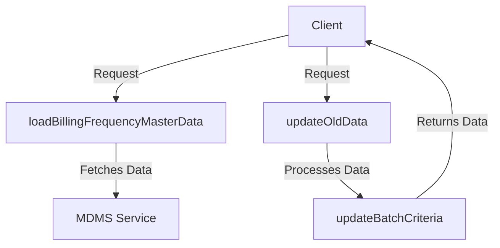

# Overview

Water service components are modular elements designed to handle specific functionalities within the water service management system. These components interact with each other and with external systems to provide a cohesive and functional water service management system.

# Service Details

This section describes the functionalities provided by the water service, such as applying for water connections, searching for connections, and handling notifications based on application state.

## API Details

This section provides details on the API endpoints for creating, updating, and searching water service applications.

## <SwmToken path="municipal-services/ws-services/src/main/java/org/egov/waterconnection/service/UserService.java" pos="25:4:4" line-data="public class UserService {">`UserService`</SwmToken> Example

The <SwmToken path="municipal-services/ws-services/src/main/java/org/egov/waterconnection/service/UserService.java" pos="25:4:4" line-data="public class UserService {">`UserService`</SwmToken> class handles the creation and management of user data related to water connections. It includes methods for creating users, fetching mobile numbers, and setting user details.

<SwmSnippet path="/municipal-services/ws-services/src/main/java/org/egov/waterconnection/service/UserService.java" line="24">

---

The <SwmToken path="municipal-services/ws-services/src/main/java/org/egov/waterconnection/service/UserService.java" pos="25:4:4" line-data="public class UserService {">`UserService`</SwmToken> class is annotated with <SwmToken path="municipal-services/ws-services/src/main/java/org/egov/waterconnection/service/UserService.java" pos="24:0:1" line-data="@Service">`@Service`</SwmToken> and uses dependency injection to include various components like <SwmToken path="municipal-services/ws-services/src/main/java/org/egov/waterconnection/service/UserService.java" pos="27:3:3" line-data="	private WSConfiguration configuration;">`WSConfiguration`</SwmToken>, <SwmToken path="municipal-services/ws-services/src/main/java/org/egov/waterconnection/service/UserService.java" pos="30:3:3" line-data="	private ServiceRequestRepository serviceRequestRepository;">`ServiceRequestRepository`</SwmToken>, <SwmToken path="municipal-services/ws-services/src/main/java/org/egov/waterconnection/service/UserService.java" pos="33:3:3" line-data="	private ObjectMapper mapper;">`ObjectMapper`</SwmToken>, and <SwmToken path="municipal-services/ws-services/src/main/java/org/egov/waterconnection/service/UserService.java" pos="36:3:3" line-data="	private EnrichmentService enrichmentService;">`EnrichmentService`</SwmToken>.

```java
@Service
public class UserService {
	@Autowired
	private WSConfiguration configuration;

	@Autowired
	private ServiceRequestRepository serviceRequestRepository;

	@Autowired
	private ObjectMapper mapper;

	@Autowired
	private EnrichmentService enrichmentService;

	/**
	 * Creates user of the connection holders of water connection if it is not
	 * created already
	 *
	 * @param request WaterConnectionRequest
	 */
```

---

</SwmSnippet>

# Main Functions

There are several main functions in this folder. Some of them are <SwmToken path="municipal-services/ws-services/src/main/java/org/egov/waterconnection/service/CalculationService.java" pos="69:5:5" line-data="	public void calculateFeeAndGenerateDemand(WaterConnectionRequest request, Property property) {">`calculateFeeAndGenerateDemand`</SwmToken>, <SwmToken path="municipal-services/ws-services/src/main/java/org/egov/waterconnection/service/UserService.java" pos="44:5:5" line-data="	public void createUser(WaterConnectionRequest request) {">`createUser`</SwmToken>, `enrichWaterConnection`, <SwmToken path="municipal-services/ws-services/src/main/java/org/egov/waterconnection/service/WaterEncryptionService.java" pos="74:7:7" line-data="     * Data encryption process takes place in batches.">`process`</SwmToken>, <SwmToken path="municipal-services/ws-services/src/main/java/org/egov/waterconnection/service/MasterDataService.java" pos="57:11:11" line-data="	public Map&lt;String, Object&gt; loadBillingFrequencyMasterData(RequestInfo requestInfo, String tenantId) {">`loadBillingFrequencyMasterData`</SwmToken>, and <SwmToken path="municipal-services/ws-services/src/main/java/org/egov/waterconnection/service/MasterDataService.java" pos="68:5:5" line-data="	public String getBillingCycle(RequestInfo requestInfo, String tenantId) {">`getBillingCycle`</SwmToken>. We will dive a little into <SwmToken path="municipal-services/ws-services/src/main/java/org/egov/waterconnection/service/CalculationService.java" pos="69:5:5" line-data="	public void calculateFeeAndGenerateDemand(WaterConnectionRequest request, Property property) {">`calculateFeeAndGenerateDemand`</SwmToken> and <SwmToken path="municipal-services/ws-services/src/main/java/org/egov/waterconnection/service/UserService.java" pos="44:5:5" line-data="	public void createUser(WaterConnectionRequest request) {">`createUser`</SwmToken>.

## <SwmToken path="municipal-services/ws-services/src/main/java/org/egov/waterconnection/service/CalculationService.java" pos="69:5:5" line-data="	public void calculateFeeAndGenerateDemand(WaterConnectionRequest request, Property property) {">`calculateFeeAndGenerateDemand`</SwmToken>

The <SwmToken path="municipal-services/ws-services/src/main/java/org/egov/waterconnection/service/CalculationService.java" pos="69:5:5" line-data="	public void calculateFeeAndGenerateDemand(WaterConnectionRequest request, Property property) {">`calculateFeeAndGenerateDemand`</SwmToken> function is responsible for estimating the fee for water applications and generating the demand. It checks the action type and accordingly builds the calculation criteria and request. It then fetches the result from the service request repository and processes the response.

<SwmSnippet path="/municipal-services/ws-services/src/main/java/org/egov/waterconnection/service/CalculationService.java" line="69">

---

The <SwmToken path="municipal-services/ws-services/src/main/java/org/egov/waterconnection/service/CalculationService.java" pos="69:5:5" line-data="	public void calculateFeeAndGenerateDemand(WaterConnectionRequest request, Property property) {">`calculateFeeAndGenerateDemand`</SwmToken> function checks the action type and builds the calculation criteria and request. It fetches the result from the service request repository and processes the response.

```java
	public void calculateFeeAndGenerateDemand(WaterConnectionRequest request, Property property) {
		if(WCConstants.APPROVE_CONNECTION_CONST.equalsIgnoreCase(request.getWaterConnection().getProcessInstance().getAction())) {
			CalculationCriteria criteria = CalculationCriteria.builder()
					.applicationNo(request.getWaterConnection().getApplicationNo())
					.waterConnection(request.getWaterConnection())
					.tenantId(property.getTenantId()).build();
			CalculationReq calRequest = CalculationReq.builder().calculationCriteria(Arrays.asList(criteria))
					.requestInfo(request.getRequestInfo()).isconnectionCalculation(false).isDisconnectionRequest(false).build();
			try {
				Object response = serviceRequestRepository.fetchResult(waterServiceUtil.getCalculatorURL(), calRequest);
				CalculationRes calResponse = mapper.convertValue(response, CalculationRes.class);
			} catch (Exception ex) {
				log.error("Calculation response error!!", ex);
				throw new CustomException("WATER_CALCULATION_EXCEPTION", "Calculation response can not parsed!!!");
			}
		} else if (WCConstants.APPROVE_DISCONNECTION_CONST.equalsIgnoreCase(request.getWaterConnection().getProcessInstance().getAction())) {
			CalculationCriteria criteria = CalculationCriteria.builder()
					.applicationNo(request.getWaterConnection().getApplicationNo())
					.waterConnection(request.getWaterConnection())
					.tenantId(property.getTenantId()).connectionNo(request.getWaterConnection().getConnectionNo()).build();
			CalculationReq calRequest = CalculationReq.builder().calculationCriteria(Arrays.asList(criteria))
```

---

</SwmSnippet>

## <SwmToken path="municipal-services/ws-services/src/main/java/org/egov/waterconnection/service/UserService.java" pos="44:5:5" line-data="	public void createUser(WaterConnectionRequest request) {">`createUser`</SwmToken>

The <SwmToken path="municipal-services/ws-services/src/main/java/org/egov/waterconnection/service/UserService.java" pos="44:5:5" line-data="	public void createUser(WaterConnectionRequest request) {">`createUser`</SwmToken> function handles the creation of user data related to water connections. It checks if the connection holders already exist and if not, it sets default fields and makes a call to create the user. If the user already exists, it updates the user details.

<SwmSnippet path="/municipal-services/ws-services/src/main/java/org/egov/waterconnection/service/UserService.java" line="44">

---

The <SwmToken path="municipal-services/ws-services/src/main/java/org/egov/waterconnection/service/UserService.java" pos="44:5:5" line-data="	public void createUser(WaterConnectionRequest request) {">`createUser`</SwmToken> function checks if the connection holders already exist and if not, it sets default fields and makes a call to create the user. If the user already exists, it updates the user details.

```java
	public void createUser(WaterConnectionRequest request) {
		if (!CollectionUtils.isEmpty(request.getWaterConnection().getConnectionHolders())) {
			Role role = getCitizenRole();
			Set<String> listOfMobileNumbers = getMobileNumbers(request);
			request.getWaterConnection().getConnectionHolders().forEach(holderInfo -> {
				addUserDefaultFields(request.getWaterConnection().getTenantId(), role, holderInfo);
				UserDetailResponse userDetailResponse = userExists(holderInfo, request.getRequestInfo());
				if (CollectionUtils.isEmpty(userDetailResponse.getUser())) {
					/*
					 * Sets userName equal to mobileNumber
					 *
					 * If mobileNumber already assigned as user-name for another user
					 *
					 * then random uuid is assigned as user-name
					 */
					StringBuilder uri = new StringBuilder(configuration.getUserHost())
							.append(configuration.getUserContextPath()).append(configuration.getUserCreateEndPoint());
					setUserName(holderInfo, listOfMobileNumbers);

					ConnectionUserRequest userRequest = ConnectionUserRequest.builder()
							.requestInfo(request.getRequestInfo()).user(holderInfo).build();
```

---

</SwmSnippet>

# Service Endpoints

This section describes the service endpoints used in the water service management system.

## <SwmToken path="municipal-services/ws-services/src/main/java/org/egov/waterconnection/service/MasterDataService.java" pos="57:11:11" line-data="	public Map&lt;String, Object&gt; loadBillingFrequencyMasterData(RequestInfo requestInfo, String tenantId) {">`loadBillingFrequencyMasterData`</SwmToken>

The <SwmToken path="municipal-services/ws-services/src/main/java/org/egov/waterconnection/service/MasterDataService.java" pos="57:11:11" line-data="	public Map&lt;String, Object&gt; loadBillingFrequencyMasterData(RequestInfo requestInfo, String tenantId) {">`loadBillingFrequencyMasterData`</SwmToken> endpoint fetches the billing frequency master data from the MDMS service. It constructs an MDMS criteria request and sends it to the MDMS service to retrieve the billing frequency details.

<SwmSnippet path="/municipal-services/ws-services/src/main/java/org/egov/waterconnection/service/MasterDataService.java" line="57">

---

The <SwmToken path="municipal-services/ws-services/src/main/java/org/egov/waterconnection/service/MasterDataService.java" pos="57:11:11" line-data="	public Map&lt;String, Object&gt; loadBillingFrequencyMasterData(RequestInfo requestInfo, String tenantId) {">`loadBillingFrequencyMasterData`</SwmToken> function constructs an MDMS criteria request and sends it to the MDMS service to retrieve the billing frequency details.

```java
	public Map<String, Object> loadBillingFrequencyMasterData(RequestInfo requestInfo, String tenantId) {
		MdmsCriteriaReq mdmsCriteriaReq = getBillingFrequency(requestInfo, tenantId);
		StringBuilder uri = new StringBuilder(mdmsHost).append(mdmsEndpoint);
		Object res = repository.fetchResult(uri, mdmsCriteriaReq);
		if (res == null) {
			throw new CustomException("MDMS_ERROR_FOR_BILLING_FREQUENCY", "ERROR IN FETCHING THE BILLING FREQUENCY");
		}
		List<Map<String, Object>> jsonOutput = JsonPath.read(res, WCConstants.JSONPATH_ROOT_FOR_BILLING);
		return jsonOutput.get(0);
	}
```

---

</SwmSnippet>

## <SwmToken path="municipal-services/ws-services/src/main/java/org/egov/waterconnection/service/WaterEncryptionService.java" pos="68:5:5" line-data="    public WaterConnectionResponse updateOldData(SearchCriteria criteria, RequestInfo requestInfo) {">`updateOldData`</SwmToken>

The <SwmToken path="municipal-services/ws-services/src/main/java/org/egov/waterconnection/service/WaterEncryptionService.java" pos="68:5:5" line-data="    public WaterConnectionResponse updateOldData(SearchCriteria criteria, RequestInfo requestInfo) {">`updateOldData`</SwmToken> endpoint initiates the encryption of old water connection data. It uses the <SwmToken path="municipal-services/ws-services/src/main/java/org/egov/waterconnection/service/WaterEncryptionService.java" pos="69:7:7" line-data="        WaterConnectionResponse waterConnectionResponse = updateBatchCriteria(requestInfo, criteria);">`updateBatchCriteria`</SwmToken> method to process the data in batches and returns the encrypted water connection data.

<SwmSnippet path="/municipal-services/ws-services/src/main/java/org/egov/waterconnection/service/WaterEncryptionService.java" line="68">

---

The <SwmToken path="municipal-services/ws-services/src/main/java/org/egov/waterconnection/service/WaterEncryptionService.java" pos="68:5:5" line-data="    public WaterConnectionResponse updateOldData(SearchCriteria criteria, RequestInfo requestInfo) {">`updateOldData`</SwmToken> function initiates the encryption of old water connection data and returns the encrypted data.

```java
    public WaterConnectionResponse updateOldData(SearchCriteria criteria, RequestInfo requestInfo) {
        WaterConnectionResponse waterConnectionResponse = updateBatchCriteria(requestInfo, criteria);
        return waterConnectionResponse;
    }
```

---

</SwmSnippet>

&nbsp;

*This is an auto-generated document by Swimm AI 🌊 and has not yet been verified by a human*

<SwmMeta version="3.0.0" repo-id="Z2l0aHViJTNBJTNBRElHSVQtT1NTJTNBJTNBU3dpbW0tRGVtbw==" repo-name="DIGIT-OSS" doc-type="overview"><sup>Powered by [Swimm](/)</sup></SwmMeta>
