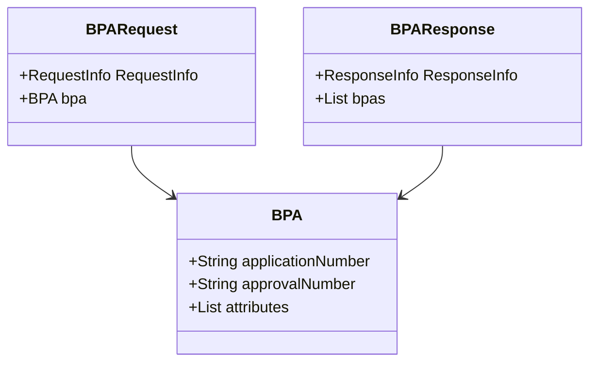

# Overview

Web Models in Bpa Services refer to the package <SwmToken path="municipal-services/bpa-services/src/main/java/org/egov/bpa/web/model/BPARequest.java" pos="1:2:10" line-data="package org.egov.bpa.web.model;">`org.egov.bpa.web.model`</SwmToken> which contains various model classes used in the Building Plan Approval (BPA) module. These models are essential for handling building permit applications, encapsulating details, and managing requests and responses.

# BPA Class

The <SwmToken path="municipal-services/bpa-services/src/main/java/org/egov/bpa/web/model/BPARequest.java" pos="1:6:6" line-data="package org.egov.bpa.web.model;">`bpa`</SwmToken> class represents the main entity for building permit applications. It encapsulates details such as application number, approval number, and various other attributes related to the building permit.

# <SwmToken path="municipal-services/bpa-services/src/main/java/org/egov/bpa/web/controller/BPAController.java" pos="47:16:16" line-data="	public ResponseEntity&lt;BPAResponse&gt; create(@Valid @RequestBody BPARequest bpaRequest) {">`BPARequest`</SwmToken> Class

The <SwmToken path="municipal-services/bpa-services/src/main/java/org/egov/bpa/web/controller/BPAController.java" pos="47:16:16" line-data="	public ResponseEntity&lt;BPAResponse&gt; create(@Valid @RequestBody BPARequest bpaRequest) {">`BPARequest`</SwmToken> class is a contract class used to receive requests for creating or updating building permit applications. It contains a <SwmToken path="municipal-services/bpa-services/src/main/java/org/egov/bpa/web/model/BPARequest.java" pos="7:12:12" line-data="import org.egov.common.contract.request.RequestInfo;">`RequestInfo`</SwmToken> object and a <SwmToken path="municipal-services/bpa-services/src/main/java/org/egov/bpa/web/model/BPARequest.java" pos="1:6:6" line-data="package org.egov.bpa.web.model;">`bpa`</SwmToken> object.

<SwmSnippet path="/municipal-services/bpa-services/src/main/java/org/egov/bpa/web/model/BPARequest.java" line="1">

---

The <SwmToken path="municipal-services/bpa-services/src/main/java/org/egov/bpa/web/controller/BPAController.java" pos="47:16:16" line-data="	public ResponseEntity&lt;BPAResponse&gt; create(@Valid @RequestBody BPARequest bpaRequest) {">`BPARequest`</SwmToken> class is defined here, used to receive requests for creating or updating building permit applications.

```java
package org.egov.bpa.web.model;

import java.util.Objects;

import javax.validation.Valid;

import org.egov.common.contract.request.RequestInfo;
import org.springframework.validation.annotation.Validated;

import com.fasterxml.jackson.annotation.JsonProperty;

import io.swagger.annotations.ApiModel;
import io.swagger.annotations.ApiModelProperty;
import lombok.AllArgsConstructor;
import lombok.Builder;
import lombok.NoArgsConstructor;

/**
 * Contract class to receive request. Array of Property items  are used in case of create . Where as single Property item is used for update
 */
```

---

</SwmSnippet>

<SwmSnippet path="/municipal-services/bpa-services/src/main/java/org/egov/bpa/web/model/BPAResponse.java" line="1">

---

The <SwmToken path="municipal-services/bpa-services/src/main/java/org/egov/bpa/web/controller/BPAController.java" pos="47:5:5" line-data="	public ResponseEntity&lt;BPAResponse&gt; create(@Valid @RequestBody BPARequest bpaRequest) {">`BPAResponse`</SwmToken> class is defined here, used to send responses back to the client.

```java
package  org.egov.bpa.web.model;

import java.util.List;
import java.util.Objects;

import javax.validation.Valid;

import org.egov.common.contract.response.ResponseInfo;
import org.springframework.validation.annotation.Validated;

import com.fasterxml.jackson.annotation.JsonProperty;

import io.swagger.annotations.ApiModel;
import io.swagger.annotations.ApiModelProperty;
import lombok.AllArgsConstructor;
import lombok.Builder;
import lombok.Getter;
import lombok.NoArgsConstructor;
import lombok.Setter;

```

---

</SwmSnippet>

# BPA Service Endpoints

The BPA service endpoints handle the creation and updating of building permit applications. These endpoints accept <SwmToken path="municipal-services/bpa-services/src/main/java/org/egov/bpa/web/controller/BPAController.java" pos="47:16:16" line-data="	public ResponseEntity&lt;BPAResponse&gt; create(@Valid @RequestBody BPARequest bpaRequest) {">`BPARequest`</SwmToken> objects, process them, and return <SwmToken path="municipal-services/bpa-services/src/main/java/org/egov/bpa/web/controller/BPAController.java" pos="47:5:5" line-data="	public ResponseEntity&lt;BPAResponse&gt; create(@Valid @RequestBody BPARequest bpaRequest) {">`BPAResponse`</SwmToken> objects.

<SwmSnippet path="/municipal-services/bpa-services/src/main/java/org/egov/bpa/web/controller/BPAController.java" line="46">

---

The `/v1/bpa/_create` endpoint is defined here, handling the creation of new building permit applications.

```java
	@PostMapping(value = "/_create")
	public ResponseEntity<BPAResponse> create(@Valid @RequestBody BPARequest bpaRequest) {
		bpaUtil.defaultJsonPathConfig();
		BPA bpa = bpaService.create(bpaRequest);
		List<BPA> bpas = new ArrayList<BPA>();
		bpas.add(bpa);
		BPAResponse response = BPAResponse.builder().BPA(bpas)
				.responseInfo(responseInfoFactory.createResponseInfoFromRequestInfo(bpaRequest.getRequestInfo(), true))
				.build();
		return new ResponseEntity<>(response, HttpStatus.OK);
	}
```

---

</SwmSnippet>

## /v1/bpa/\_update

The `/v1/bpa/_update` endpoint is used to update an existing building permit application. It accepts a <SwmToken path="municipal-services/bpa-services/src/main/java/org/egov/bpa/web/controller/BPAController.java" pos="47:16:16" line-data="	public ResponseEntity&lt;BPAResponse&gt; create(@Valid @RequestBody BPARequest bpaRequest) {">`BPARequest`</SwmToken> object in the request body, processes it using the <SwmToken path="municipal-services/bpa-services/src/main/java/org/egov/bpa/web/controller/BPAController.java" pos="60:7:9" line-data="		BPA bpa = bpaService.update(bpaRequest);">`bpaService.update`</SwmToken> method, and returns a <SwmToken path="municipal-services/bpa-services/src/main/java/org/egov/bpa/web/controller/BPAController.java" pos="47:5:5" line-data="	public ResponseEntity&lt;BPAResponse&gt; create(@Valid @RequestBody BPARequest bpaRequest) {">`BPAResponse`</SwmToken> object containing the updated <SwmToken path="municipal-services/bpa-services/src/main/java/org/egov/bpa/web/model/BPARequest.java" pos="1:6:6" line-data="package org.egov.bpa.web.model;">`bpa`</SwmToken> entity.

<SwmSnippet path="/municipal-services/bpa-services/src/main/java/org/egov/bpa/web/controller/BPAController.java" line="58">

---

The `/v1/bpa/_update` endpoint is defined here, handling the updating of existing building permit applications.

```java
	@PostMapping(value = "/_update")
	public ResponseEntity<BPAResponse> update(@Valid @RequestBody BPARequest bpaRequest) {
		BPA bpa = bpaService.update(bpaRequest);
		List<BPA> bpas = new ArrayList<BPA>();
		bpas.add(bpa);
		BPAResponse response = BPAResponse.builder().BPA(bpas)
				.responseInfo(responseInfoFactory.createResponseInfoFromRequestInfo(bpaRequest.getRequestInfo(), true))
				.build();
		return new ResponseEntity<>(response, HttpStatus.OK);
```

---

</SwmSnippet>

&nbsp;

*This is an auto-generated document by Swimm AI 🌊 and has not yet been verified by a human*

<SwmMeta version="3.0.0" repo-id="Z2l0aHViJTNBJTNBRElHSVQtT1NTJTNBJTNBU3dpbW0tRGVtbw==" repo-name="DIGIT-OSS" doc-type="overview"><sup>Powered by [Swimm](/)</sup></SwmMeta>
