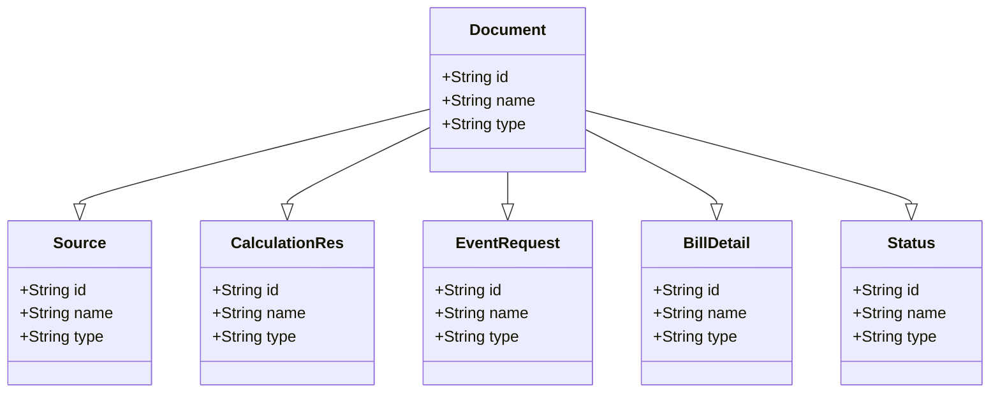

# Overview

Web refers to the web-based components and models used in the property tax services module (pt-services-v2). These models define the structure and behavior of data related to property tax services, handling requests and responses, validating data, and managing the overall workflow of property tax-related operations.

# Document Model

The `Document` model holds information about documents attached during property transactions. It is essential for managing the documentation process within the property tax services.

# Source Model

The `Source` model defines the source of the request, such as from a web application or mobile application. This helps in identifying and processing requests based on their origin.

# CalculationRes Model

The `CalculationRes` model is used to store the results of various calculations related to property tax. This model ensures that all calculation results are structured and accessible for further processing.

# <SwmToken path="municipal-services/pt-services-v2/src/main/java/org/egov/pt/web/models/EventRequest.java" pos="60:4:4" line-data="public class EventRequest {">`EventRequest`</SwmToken> Model

The <SwmToken path="municipal-services/pt-services-v2/src/main/java/org/egov/pt/web/models/EventRequest.java" pos="60:4:4" line-data="public class EventRequest {">`EventRequest`</SwmToken> model handles event-related requests in the property tax services module. It is crucial for managing events and ensuring that all event-related data is processed correctly.

<SwmSnippet path="/municipal-services/pt-services-v2/src/main/java/org/egov/pt/web/models/EventRequest.java" line="35">

---

The <SwmToken path="municipal-services/pt-services-v2/src/main/java/org/egov/pt/web/models/EventRequest.java" pos="60:4:4" line-data="public class EventRequest {">`EventRequest`</SwmToken> model is defined in the file <SwmPath>[municipal-services/pt-services-v2/src/main/java/org/egov/pt/web/models/EventRequest.java](municipal-services/pt-services-v2/src/main/java/org/egov/pt/web/models/EventRequest.java)</SwmPath>.

```java
 *         with regards to rights under trademark law for use of the trade names
```

---

</SwmSnippet>

# BillDetail Model

The `BillDetail` model manages billing details in property tax services. It ensures that all billing information is accurately recorded and processed.

# Status Model

The `Status` model represents the status of various operations within the property tax services module. It helps in tracking the progress and state of different processes.

&nbsp;

*This is an auto-generated document by Swimm AI 🌊 and has not yet been verified by a human*

<SwmMeta version="3.0.0" repo-id="Z2l0aHViJTNBJTNBRElHSVQtT1NTJTNBJTNBU3dpbW0tRGVtbw==" repo-name="DIGIT-OSS" doc-type="overview"><sup>Powered by [Swimm](/)</sup></SwmMeta>
