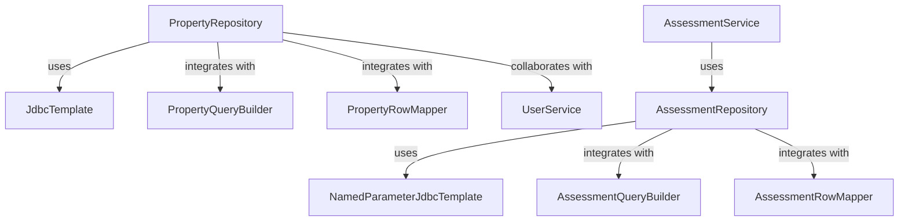

# Overview

The repository in Property Services is responsible for interacting with the database to perform various operations related to properties. It uses `JdbcTemplate` to execute SQL queries and retrieve data from the database.

# PropertyRepository Class

The `PropertyRepository` class includes methods to fetch property IDs, search for properties based on criteria, and perform bulk searches. It integrates with other components like `PropertyQueryBuilder` to build dynamic SQL queries and `PropertyRowMapper` to map the results to property objects. Additionally, it collaborates with the `UserService` to enrich property data with owner information.

# Repository Structure

The repository structure is organized to separate different modules and functionalities, making it easier to manage and scale the application.

# Using Repositories

The `AssessmentService` class demonstrates how to use the `AssessmentRepository` by injecting it using `@Autowired` and calling its methods to perform database operations.

<SwmSnippet path="/municipal-services/property-services/src/main/java/org/egov/pt/service/AssessmentService.java" line="20">

---

The `AssessmentService` class shows the usage of `AssessmentRepository` by injecting it and calling its methods.

```java
import org.egov.pt.producer.PropertyProducer;
import org.egov.pt.repository.AssessmentRepository;
import org.egov.pt.util.AssessmentUtils;
import org.egov.pt.validator.AssessmentValidator;
import org.egov.pt.web.contracts.AssessmentRequest;
import org.springframework.beans.factory.annotation.Autowired;
import org.springframework.stereotype.Service;
import org.springframework.util.CollectionUtils;

@Service
public class AssessmentService {

	private AssessmentValidator validator;

	private PropertyProducer producer;

	private PropertyConfiguration props;

	private AssessmentRepository repository;

	private AssessmentEnrichmentService assessmentEnrichmentService;
```

---

</SwmSnippet>

# Repository Methods

The `AssessmentRepository` class contains methods like `getAssessments`, `fetchAssessmentNumbers`, and `getAssessmentFromDB` to interact with the database and perform various operations related to assessments.

<SwmSnippet path="/municipal-services/property-services/src/main/java/org/egov/pt/repository/AssessmentRepository.java" line="21">

---

The `AssessmentRepository` class uses `NamedParameterJdbcTemplate` to execute SQL queries and retrieve data from the database.

```java
@Repository
@Slf4j
public class AssessmentRepository {

    @Autowired
    private NamedParameterJdbcTemplate namedParameterJdbcTemplate;

	@Autowired
	private AssessmentQueryBuilder queryBuilder;

	@Autowired
	private AssessmentRowMapper rowMapper;
	
	
	public List<Assessment> getAssessments(AssessmentSearchCriteria criteria){
		Map<String, Object> preparedStatementValues = new HashMap<>();
		List<Assessment> assessments = new ArrayList<>();
		String query = queryBuilder.getSearchQuery(criteria, preparedStatementValues);
		log.info("Query: "+query);
		log.debug("preparedStatementValues: "+preparedStatementValues);
		assessments = namedParameterJdbcTemplate.query(query, preparedStatementValues, rowMapper);
```

---

</SwmSnippet>

# Main Functions

There are several main functions in the repository, such as `getPropertyIds`, `getProperties`, and `getPropertiesForBulkSearch`. We will dive into `getPropertyIds` and `getProperties`.

## getPropertyIds

The `getPropertyIds` function retrieves property IDs based on owner IDs and tenant ID. It uses `PropertyQueryBuilder` to build the SQL query and `JdbcTemplate` to execute it.

<SwmSnippet path="/municipal-services/property-services/src/main/java/org/egov/pt/repository/PropertyRepository.java" line="69">

---

The `getPropertyIds` function in `PropertyRepository` retrieves property IDs using `PropertyQueryBuilder` and `JdbcTemplate`.

```java
	public List<String> getPropertyIds(Set<String> ownerIds, String tenantId) {

		List<Object> preparedStmtList = new ArrayList<>();
		String query = queryBuilder.getPropertyIdsQuery(ownerIds, tenantId, preparedStmtList);
		return jdbcTemplate.queryForList(query, preparedStmtList.toArray(), String.class);
	}
```

---

</SwmSnippet>

## getProperties

The `getProperties` function searches for properties based on the given criteria. It can perform both open and plain searches, using `PropertyQueryBuilder` to build the query and `JdbcTemplate` to execute it.

<SwmSnippet path="/municipal-services/property-services/src/main/java/org/egov/pt/repository/PropertyRepository.java" line="76">

---

The `getProperties` function in `PropertyRepository` searches for properties using `PropertyQueryBuilder` and `JdbcTemplate`.

```java
	public List<Property> getProperties(PropertyCriteria criteria, Boolean isApiOpen, Boolean isPlainSearch) {

		List<Object> preparedStmtList = new ArrayList<>();
		String query = queryBuilder.getPropertySearchQuery(criteria, preparedStmtList, isPlainSearch, false);
		if (isApiOpen)
			return jdbcTemplate.query(query, preparedStmtList.toArray(), openRowMapper);
		else
			return jdbcTemplate.query(query, preparedStmtList.toArray(), rowMapper);
	}
```

---

</SwmSnippet>

&nbsp;

*This is an auto-generated document by Swimm AI 🌊 and has not yet been verified by a human*

<SwmMeta version="3.0.0" repo-id="Z2l0aHViJTNBJTNBRElHSVQtT1NTJTNBJTNBU3dpbW0tRGVtbw==" repo-name="DIGIT-OSS" doc-type="overview"><sup>Powered by [Swimm](https://app.swimm.io/)</sup></SwmMeta>
